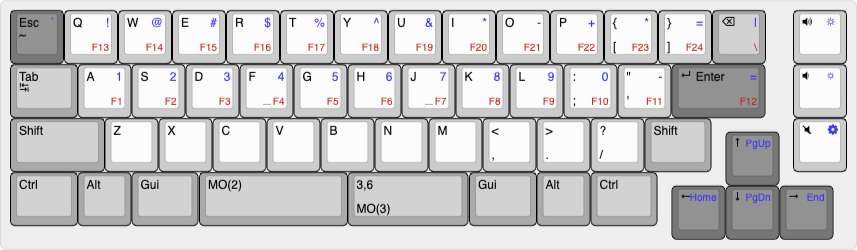

# Adelie


The Adelie 50% Keyboard by Abec13


* Keyboard Maintainer: [Abec13](https://github.com/abec13)

## Keymaps

### default
To build the default firmware for this keyboard (after setting up your build environment):
```zsh
$ make cannonkeys/adelie:default
```

### via
To build via-enabled firmware:
```zsh
$ make cannonkeys/adelie:via
```

### vial
To build vial-enabled firmware (with embedded keymap):
```zsh
$ make cannonkeys/adelie:vial
```

## Releases
For convenience, there are prebuilt binaries available to download under releases, see: https://github.com/joeblackwaslike/vial-qmk/releases/tag/vial, the can be flashed using QMK Toolbox.
## Environment
See the [build environment setup](https://docs.qmk.fm/#/getting_started_build_tools) and the [make instructions](https://docs.qmk.fm/#/getting_started_make_guide) for more information. Brand new to QMK? Start with our [Complete Newbs Guide](https://docs.qmk.fm/#/newbs).

## Port Reference
Check out the following links for customization options
* [via porting guide part 1](https://get.vial.today/docs/porting-to-via.html)
* [vial porting guide part 2](https://get.vial.today/docs/porting-to-vial.html)
